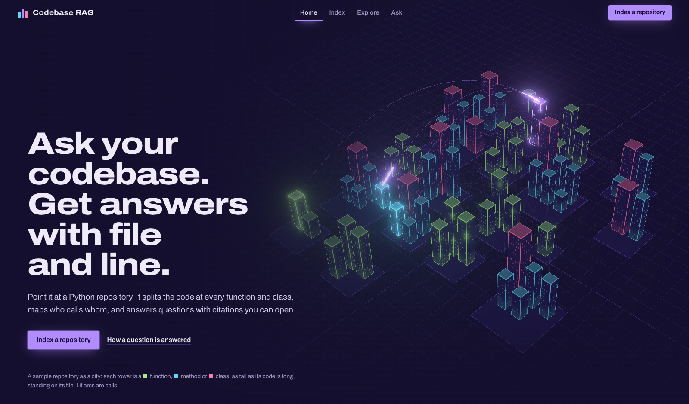
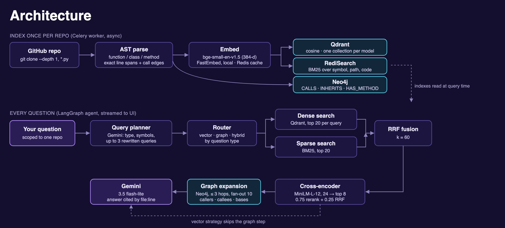
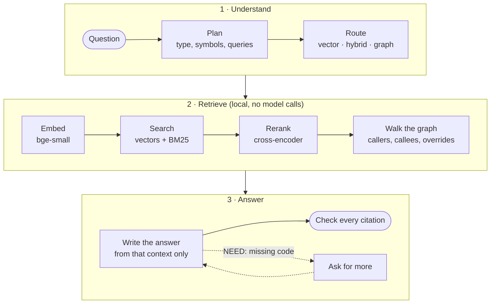

<div align="center">

# Codebase RAG

**Ask questions about any Python, JavaScript or TypeScript repository.<br>Get answers that cite the file and line, and every citation is checked.**

[](https://github.com/CodeBox-commits/git-rag-project/actions/workflows/ci.yml)


[Quick start](#quick-start) · [How it works](#how-it-works) · [MCP server](#mcp-server) · [API](#api) · [Development](#development)



</div>

## Highlights

- **Answers you can check.** Every claim cites `path/to/file.py:line`, and each citation is matched against the code the
  model was actually shown: *verified*, *from the call graph*, or flagged as unverified. Click one to open that code.
- **Indexed the way you read code.** One chunk per function, class and method, linked into a real call graph in Neo4j,
  so "who calls this?" and "what breaks if I change it?" are exact lookups, not guesses.
- **Hybrid retrieval.** Vector search and BM25 are fused by rank, reranked by a local cross-encoder, then expanded
  through the graph to pull in callers, callees and overrides the search missed.
- **Watch it think.** The pipeline plays out live above each answer: the plan, the searches, the candidates being
  reranked, the graph walk, and the snippets the model reads. Every step can be opened in the inspector.
- **Walk it as a city.** Each symbol is a glass tower, calls are light arcs between them, and an impact query lights up
  the whole blast radius, hop by hop.
- **A tool for coding agents.** The same code intelligence is an MCP server, so Claude Code, Cursor and others can
  search, find callers and check impact while they work.
- **Cheap to run.** Embeddings and reranking run locally on CPU. Gemini is only called to plan and answer questions,
  and re-indexing only re-embeds files that changed.

## Why not plain RAG?

Most RAG pipelines cut source code into fixed-size chunks. A function ends up split across two chunks, neither of
which makes sense alone, and the retriever has no idea who calls what.

| | Plain RAG over code | Codebase RAG |
|---|---|---|
| Chunks | Fixed-size windows that cut functions in half | One chunk per symbol, with its qualified name (`InvoiceService.finalize`) and exact line range |
| Relationships | Inferred from text, if at all | A call graph: `CALLS`, `INHERITS`, `HAS_METHOD` and overrides, resolved from `self.validate()`, `module.fn()` and `Class()`. Calls it can't resolve are left out instead of guessed |
| Exact names | Embeddings blur `check_totals` into "something about totals" | BM25 runs next to vector search, so `check_totals` finds `check_totals` |
| Missing context | The model guesses | The model can ask for the code it's missing (`NEED: <names>`) before it answers |
| Sources | "Trust me" | Every `file:line` is checked against what the model saw |

## What you can do

| Page | What it does |
|---|---|
| **Index** | Paste a public GitHub URL and watch it clone, parse, embed, store and link, with live progress for each stage. **Update** re-embeds only the files that changed; **Rebuild everything** starts over. |
| **Explore** | Walk the repository as a neon code city. Each tower is a function (lime), method (cyan) or class (rose), as tall as its code is long, standing on its file's plot. Click one and the camera flies to it and lights its calls, or ask **"What breaks if this changes?"** to light up everything that calls, subclasses or overrides it, up to 3 hops away, with a per-file list. Switch to a force-directed graph, filter by file or search by name. |
| **Ask** | Ask in plain English and follow up ("and what calls it?"). The answer streams in while the pipeline plays out above it; the inspector beside it shows each step's plan, queries, ranked hits, reranker moves and call tree. Citations are chips marked verified or unverified; click one to open the cited lines. |
| **MCP** | Coding agents use the same lookups as tools: see [MCP server](#mcp-server). |

Press <kbd>⌘K</kbd> (or <kbd>Ctrl K</kbd>) anywhere to jump to a page, switch repository or find a symbol.

## Quick start

You need Docker and a free [Google AI Studio](https://aistudio.google.com/) API key. The key is only used to answer
questions; indexing runs fully locally.

```bash
git clone https://github.com/CodeBox-commits/git-rag-project.git
cd git-rag-project
cp backend/.env.example backend/.env    # then set GEMINI_API_KEY
docker compose up -d --build
```

Open <http://localhost:8000>, index a repository (for example `https://github.com/pallets/click`), then explore it or
ask a question. Check that everything is up with `curl -s localhost:8000/ready`, and stop it with
`docker compose down` (indexed data is kept in Docker volumes).

> [!NOTE]
> Everything you index stays on your machine: the repository is cloned to a temporary folder, indexed into the local
> databases, then deleted. Your key stays in `backend/.env`, which git and the Docker build both ignore. The local
> stack listens on `127.0.0.1` only, since it has no sign-in; see [Deployment](#deployment) for running it on a server.

## How it works



### Answering a question

A LangGraph state machine, with one model call to plan and one to answer:



1. **Plan:** one Gemini call classifies the question, pulls out symbol names and writes up to three search queries.
2. **Route:** lookups walk the graph 1 hop; call-flow, dependency and architecture questions walk 3 hops and use full
   BM25. "What breaks if I change X?" questions also get X's exact blast radius from the graph.
3. **Search:** vector search (top 20 per query) and BM25 (top 20) are merged with Reciprocal Rank Fusion (k = 60) into
   24 candidates.
4. **Rerank:** a local cross-encoder (FlashRank `ms-marco-MiniLM-L-12-v2`) keeps the 8 best, blending 0.75 reranker
   score with 0.25 retrieval score.
5. **Walk the graph:** Neo4j returns callers, callees, base classes, methods and overrides (same-named methods up and
   down the class hierarchy). The code of up to 6 related symbols the search missed is pulled in too: symbols named in
   the question, overrides of retrieved methods, and direct callees of the top hits.
6. **Ask for more (optional):** if code it needs isn't in the context, the model replies `NEED: <names>` instead of
   guessing; those symbols are fetched (exact lookup, then search) and it answers. One round, never shown to the user,
   and skippable per question (`allow_followup: false`, or the toggle under the Ask box).
7. **Answer:** Gemini writes the answer from that context only, with file-and-line citations, streamed as Server-Sent
   Events. If the model is rate-limited, `LLM_FALLBACK_MODEL` is tried; with no model at all, the answer lists the
   retrieved code instead of failing.
8. **Check citations:** every `path:line` in the answer is matched against what the model was shown: *verified* (the
   line was in shown code), *graph* (a location from the call graph), or unverified (*wrong line* / *unknown file*).

### Indexing a repository

Indexing runs in a Celery worker, so the UI never blocks:

1. Shallow-clone the repository (`git clone --depth 1`), skipping tests, virtualenvs, `node_modules` and `.git`.
2. Compare each file's git blob hash with the last run: only **new or changed** files go on to be embedded and stored;
   deleted files are removed. An unchanged commit returns "up to date" at once.
3. Parse every Python, JavaScript and TypeScript file into symbols with exact line spans and call sites. All files are
   parsed (it's cheap), so calls between changed and unchanged files resolve correctly.
4. Embed the changed chunks locally with `BAAI/bge-small-en-v1.5` (384-d, via FastEmbed).
5. Swap each changed file's old vectors (Qdrant), BM25 entries (RediSearch) and symbols (Neo4j) for the new ones once
   they're ready, so the repository never goes empty; then re-link every call and inheritance edge. A file that fails
   keeps its old data and is retried next run. `"full": true`, or a parser change (`INDEX_VERSION`), rebuilds
   everything.

## Tech stack

| Layer | Tools |
|---|---|
| API | FastAPI, Server-Sent Events |
| Background jobs | Celery with a Redis broker |
| Agent | LangGraph, Gemini (`gemini-3.5-flash-lite` by default) |
| Parsing | Python `ast`; tree-sitter for JavaScript and TypeScript |
| Embeddings | FastEmbed `bge-small-en-v1.5`, local and free (Gemini embeddings optional) |
| Reranking | FlashRank cross-encoder, local, CPU-only |
| Stores | Neo4j 5 (graph), Qdrant (vectors), Redis Stack / RediSearch (BM25 and cache) |
| Frontend | React 19, TypeScript, Vite, Tailwind CSS 4, shadcn/ui (Radix), Motion, Shiki, cmdk, three.js (custom shaders, bloom, reflections) |
| Ops | Docker Compose, GitHub Actions CI, GHCR release images, Caddy for production |

## MCP server

The code intelligence is also an [MCP](https://modelcontextprotocol.io) server at `/mcp`, so a coding agent can look
things up in an indexed repository while it works. Add it to Claude Code:

```bash
claude mcp add --transport http codebox http://localhost:8000/mcp
```

| Tool | What it returns |
|---|---|
| `list_repositories` | Indexed repositories (the `repo_url` every other tool takes) |
| `search_code` | Hybrid vector + BM25 search, reranked, with each hit's code |
| `find_definition` | Location, class, bases, subclasses, overrides, direct calls and callers |
| `get_symbol_code` | A symbol's full source |
| `get_code_at` | The symbol containing a `file:line`, with its code (to check a citation) |
| `find_callers` / `find_callees` | Call graph neighbours up to 5 hops away |
| `impact_of` | Blast radius of changing a symbol, grouped by file |
| `ask_codebase` | A cited answer from the full RAG pipeline, each citation with its check status (uses Gemini quota) |

All tools except `ask_codebase` are exact graph or search lookups: no LLM calls, no quota. The server is stateless and
returns plain JSON. It only answers requests whose `Host` is in `MCP_ALLOWED_HOSTS` (protection against DNS
rebinding), and when `MCP_TOKEN` is set every call needs `Authorization: Bearer <token>`. The production stack requires
a token:

```bash
claude mcp add --transport http codebox https://your.domain/mcp --header "Authorization: Bearer $MCP_TOKEN"
```

## Configuration

<details>
<summary>Environment variables in <code>backend/.env</code></summary>

<br>

See [`backend/.env.example`](backend/.env.example).

| Variable | Default | Purpose |
|---|---|---|
| `GEMINI_API_KEY` | (required) | Planner and answer model |
| `LLM_MODEL` | `gemini-3.5-flash-lite` | Gemini model for planning and answers |
| `LLM_FALLBACK_MODEL` | (unset) | Tried for answers when `LLM_MODEL` is rate-limited or overloaded |
| `AGENT_FOLLOWUP_ROUNDS` | `1` | How many times the model may ask for missing code; `0` turns ask-for-more off |
| `EMBEDDING_PROVIDER` | `local` | `local` (free, offline) or `gemini` (768-d, uses your API quota) |
| `VECTOR_TOP_K` | `8` | Chunks kept after reranking |
| `RERANK_CANDIDATES` | `24` | Candidates passed to the reranker |
| `GRAPH_MAX_DEPTH` | `3` | How many calls away graph traversal goes |
| `GRAPH_EXPAND_LIMIT` | `6` | How many related symbols' code the graph step adds to the answer context |
| `RERANKER_MODEL` | `ms-marco-MiniLM-L-12-v2` | Set to `off` to skip reranking |
| `MCP_TOKEN` | (unset) | Bearer token required on `/mcp`; unset means no auth, fine on localhost only |
| `MCP_ALLOWED_HOSTS` | `localhost:*,127.0.0.1:*,[::1]:*` | `Host` headers the MCP endpoint answers |

Each embedding model writes to its own Qdrant collection, so switching provider or model means re-indexing.

</details>

## API

<details>
<summary>REST endpoints</summary>

<br>

| Method | Path | Description |
|---|---|---|
| `POST` | `/api/v1/repo/index` | Index or update a repository (only changed files; `"full": true` rebuilds); returns a task ID |
| `GET` | `/api/v1/repo/status/{task_id}` | Stage, progress and result of an indexing task |
| `GET` | `/api/v1/repo/list` | Every indexed repository with its symbol count |
| `DELETE` | `/api/v1/repo?repo_url=…` | Remove a repository's vectors, BM25 entries and graph |
| `GET` | `/api/v1/repo/graph?repo_url=…&limit=…` | Symbols and edges for the Explore page |
| `POST` | `/api/v1/chat/` | Ask a question (`"stream"`, `"history"` for follow-ups, `"allow_followup"`); SSE when streaming |
| `GET` | `/api/v1/symbols/definitions?repo_url=…&name=…` | Every symbol with that name: location, class, bases, overrides, direct calls and callers |
| `GET` | `/api/v1/symbols/callers?repo_url=…&name=…&depth=1-5` | Who calls this symbol, up to `depth` hops back |
| `GET` | `/api/v1/symbols/callees?repo_url=…&name=…&depth=1-5` | What this symbol calls, up to `depth` hops forward |
| `GET` | `/api/v1/symbols/impact?repo_url=…&name=…&depth=1-5` | Blast radius: everything that calls, subclasses or overrides it, grouped by file |
| `GET` | `/api/v1/symbols/at?repo_url=…&filepath=…&line=…` | The function, method or class containing that line, with its code |
| `POST` | `/mcp` | MCP server (streamable HTTP) |
| `GET` | `/health` | Liveness: the process is up |
| `GET` | `/ready` | Readiness: Neo4j, Qdrant and Redis respond |

Interactive docs are at <http://localhost:8000/docs>.

</details>

## Development

Run the backend stack with Docker, and the frontend with hot reload:

```bash
docker compose up -d
cd frontend && npm install && npm run dev    # http://localhost:5173, proxies /api to :8000
```

<details>
<summary>Checks (the same ones CI runs)</summary>

<br>

Backend:

```bash
cd backend
pip install -r requirements-dev.txt
ruff check . && ruff format --check . && mypy app
pytest                       # unit tests
pytest -m integration        # needs Neo4j, Qdrant and Redis running
```

Frontend:

```bash
cd frontend
npx tsc -b && npx oxlint && npm test && npm run build
```

CI runs all of these on every pull request, plus a Docker build, deploy-config validation and secret scanning.

</details>

<details>
<summary>Project layout</summary>

<br>

```
backend/
  app/
    api/            FastAPI routes: repo, chat, symbols (code intelligence), health
    mcp_server.py   MCP tools over the same code-intelligence layer
    core/           languages/ (one parser per language), call resolver, schemas
    services/       code_intel (definitions, callers, impact, search), agent, embeddings,
                    hybrid search, reranker, Neo4j, Qdrant, RediSearch
    workers/        Celery app and the indexing task
  tests/            unit tests, plus integration/ for the full pipeline
frontend/
  src/
    components/     CodeCity (3D city), ForceGraph3D, LivePipeline, PipelineInspector, CodeViewer
    pages/          Home, Index, Explore, Ask
deploy/             production Compose stack, Caddy, backup and restore scripts
docs/               architecture diagram, deployment runbook
```

</details>

## Deployment

Release images are published to GHCR from `main` and from version tags. The production stack runs behind Caddy with
automatic HTTPS, with databases on an internal-only network. See the [deployment runbook](docs/deploy.md) for setup,
upgrades, rollback, backups and restore.

## Limitations

- Python, JavaScript and TypeScript only. Adding a language is one `Language` subclass in
  `backend/app/core/languages/` plus one line in its registry.
- Default imports (`import x from './m'`) aren't mapped to the exported name; named, namespace and `require` imports
  are. Same-named definitions in one file are kept apart as `name`, `name#2`.
- Public repositories only (cloned without credentials).
- Calls resolved through dynamic dispatch or external libraries aren't linked in the graph.
